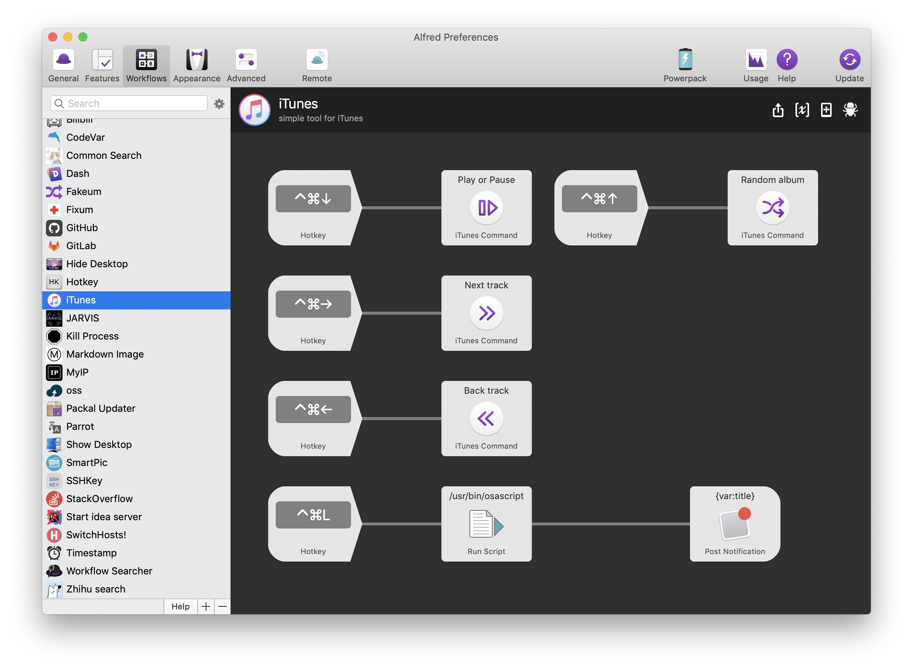

# iTunes-Action-Alfred-Workflow

This is a Alfred 3 Workflow that provides the following features:

- switch to the last song
- switch to the next song
- play album randomly 
- pause/play
- flag likes or remove likes for the song being played

这是一个 Alfred 3 的 Workflow，提供如下功能：
- 切换上一首
- 切换下一首
- 随机播放专辑
- 暂停/播放
- 为正在播放的歌曲标记喜欢或去除喜欢标记
